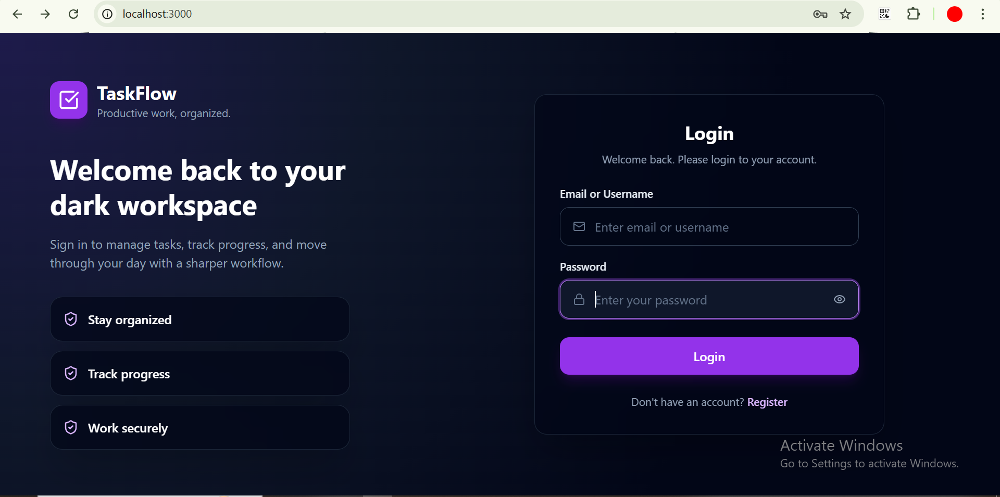
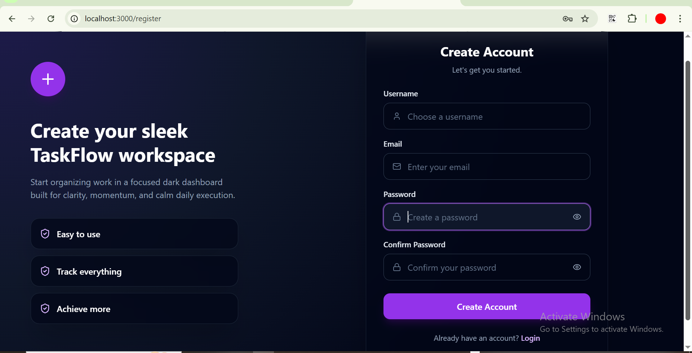
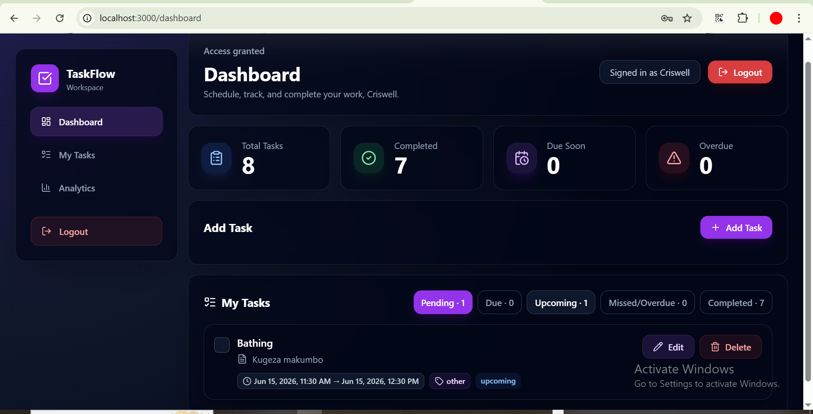
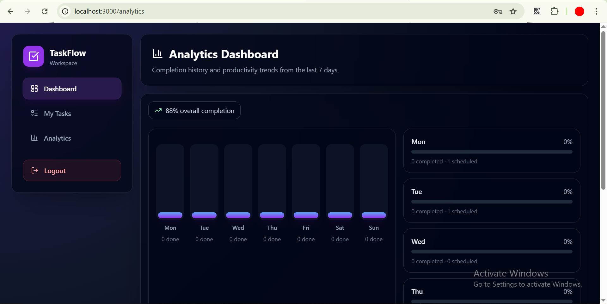
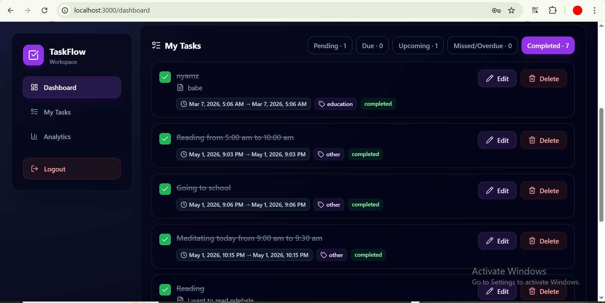

# TaskFlow: Full-Stack Authenticated To‑Do App

A professional, secure, and responsive full-stack To-Do application demonstrating modern authentication workflows and software engineering best practices.

---

## Table of Contents

- Project Overview  
- Features  
  - Backend Features  
  - Frontend Features  
  - Security Features  
  - User Experience Features  
- Tech Stack  
- Architecture Overview  
- Folder Structure  
- API Documentation  
- Installation Guide  
- Environment Variables  
- Authentication Flow  
- Screenshots  
- Error Handling  
- Future Improvements  
- Deployment  
- Learning Outcomes  
- Contributing  
- License  
- Author  
- GitHub Repository

---

## Project Overview

What it does  
- TaskFlow is a full‑stack To‑Do application that allows registered users to manage tasks in a personal dashboard behind authentication. It includes user registration, login, protected API endpoints, and a modern responsive UI.

Purpose  
- Demonstrate end‑to‑end authentication using token-based flows (JWT), RESTful API design, and a production-minded frontend built with React + TypeScript.

Authentication workflow (high level)  
- Users register with email/password → credentials are securely stored (hashed) → users login → server issues JWT access token → frontend stores token securely and uses it for subsequent API calls → protected endpoints validate token.

Why these technologies  
- Backend: Python (FastAPI/Flask) provides fast API development, type hints, and good async support.  
- Frontend: React + TypeScript offers strong developer ergonomics, type safety, and composable UI.  
- JWT: Industry-standard for stateless token-based authentication suitable for SPAs.  
- Chosen to highlight modern full‑stack patterns used in internships and production prototypes.

---

## Features

### Backend Features
- User registration endpoint with secure password hashing (bcrypt / passlib)  
- User login endpoint issuing JWT tokens (access [+ refresh optional])  
- Protected REST endpoints that validate tokens  
- Structured error responses and logging for server events  
- Input validation using pydantic / marshmallow  
- Simple migration / schema file for database initialization

### Frontend Features
- Registration and login forms with client-side validation  
- Protected dashboard and routes accessible only when authenticated  
- Token management and automatic inclusion of Authorization header  
- API integration module with typed request/response shapes (`api.ts`)  
- Loading states and form feedback for a polished UX

### Security Features
- Secure password hashing (bcrypt) with unique salts  
- JWT signatures using secret keys; configurable token expiry  
- HTTPS recommended in production; CORS restricted to allowed origins  
- Protected routes with server-side token verification  
- Minimal token surface area in local storage; recommendations for refresh tokens and HttpOnly cookies

### User Experience Features
- Responsive UI for mobile and desktop (Tailwind CSS)  
- Clear visual loading indicators and inline error messages  
- Accessible form inputs and semantic HTML structure  
- Lightweight, fast, and maintainable component structure

---

## Tech Stack

- Frontend: React, TypeScript, React Router, Axios, Tailwind CSS  
- Backend: Python, FastAPI (or Flask) — ASGI via Uvicorn, Pydantic  
- Database: SQLite (development), easy to swap to PostgreSQL for production  
- Authentication: JWT (PyJWT or jose), bcrypt (passlib)  
- Styling: Tailwind CSS, PostCSS  
- Tools: npm/yarn, pip, Uvicorn, git, Docker (optional)

Badges above show primary technologies used.

---

## Architecture Overview

- Frontend (SPA) communicates with Backend via a REST API.  
- Authentication uses token-based (JWT) flow:
  - On login, server returns a signed JWT containing user id and expiry.
  - Frontend stores token (localStorage or secure cookie) and attaches `Authorization: Bearer <token>` to API requests.
  - Backend verifies token signature and expiry on protected endpoints.
- Protected route validation:
  - Frontend prevents access to protected UI routes if token absent/invalid.
  - Server enforces authorization for all protected API endpoints regardless of frontend checks.
- Local storage token handling:
  - Access tokens stored in `localStorage` for SPA convenience (note: consider HttpOnly cookies for production refresh-token flows).

---
## Folder Structure

Example structure (trimmed for clarity):
```bash
TaskFlow/
│
├── frontend/
│   ├── public/
│   │   └── index.html
│   │
│   ├── src/
│   │   ├── pages/
│   │   │   ├── Login.tsx
│   │   │   ├── Register.tsx
│   │   │   ├── Dashboard.tsx
│   │   │   └── ProtectedPage.tsx
│   │   │
│   │   ├── services/
│   │   │   └── api.ts
│   │   │
│   │   ├── styles/
│   │   │   └── index.css
│   │   │
│   │   ├── App.tsx
│   │   └── index.tsx
│   │
│   ├── package.json
│   └── tsconfig.json
│
├── backend/
│   ├── app.py (or main.py)
│   ├── models.py
│   ├── schemas.py
│   ├── auth.py
│   ├── database.py
│   ├── migrate_tasks.py
│   ├── migrate_email.py
│   ├── schema.sql
│   └── requirements.txt
│
├── docs/
│   └── screenshots/
│       ├── login.png
│       ├── register.png
│       ├── dashboard.png
│       ├── Analytics.png
│       └── MyTasks.png
│
└── README.md
```
## API Documentation

Base URL: `http://localhost:8000` (development)

### POST /register
- Purpose: Create new user account.
- Request (JSON):
```json
POST /register
Content-Type: application/json

{
  "email": "user@example.com",
  "password": "P@ssw0rd"
}
```
- Response (201 Created):
```json
{
  "id": 1,
  "email": "user@example.com",
  "message": "User created"
}
```
- Status codes:
  - 201 Created — user successfully created
  - 400 Bad Request — validation failed / missing fields
  - 409 Conflict — email already exists
- Authentication: None

### POST /login
- Purpose: Authenticate user and receive JWT token.
- Request (JSON):
```json
POST /login
Content-Type: application/json

{
  "email": "user@example.com",
  "password": "P@ssw0rd"
}
```
- Response (200 OK):
```json
{
  "access_token": "<JWT_TOKEN>",
  "token_type": "bearer",
  "expires_in": 3600
}
```
- Status codes:
  - 200 OK — authentication successful
  - 400 Bad Request — missing fields
  - 401 Unauthorized — invalid credentials
- Authentication: None (this endpoint returns the token)

### GET /protected
- Purpose: Example protected endpoint requiring authentication.
- Request:
```
GET /protected
Headers:
  Authorization: Bearer <JWT_TOKEN>
```
- Response (200 OK):
```json
{
  "message": "Access granted",
  "user": {
    "id": 1,
    "email": "user@example.com"
  }
}
```
- Status codes:
  - 200 OK — token valid, access granted
  - 401 Unauthorized — token missing/invalid/expired
- Authentication: Required — Bearer token

---

## Installation Guide

Clone repository:
```bash
git clone https://github.com/nyamayaro-del/To-Do-List
.git
cd TaskFlow
```

Backend setup:
```bash
cd backend

# Create virtual environment
python -m venv .venv

# Activate environment (Windows PowerShell)
.venv\Scripts\Activate.ps1

# Install dependencies
pip install -r requirements.txt

# Initialize database (SQLite example)
sqlite3 db.sqlite3 < schema.sql

# Run Flask server
python app.py
```

Frontend setup:
```bash
cd ../frontend
# install dependencies
npm install
# start dev server
npm run dev
# or for CRA-like:
npm start
```

Commands summary:
- `pip install -r requirements.txt`
- ` python app.py   (Flask backend run command)`
- `npm install`
- `npm run dev` or `npm start`

---

## Environment Variables

Create a `.env` file in backend (example):
```
SECRET_KEY=your_super_secret_key_here
ACCESS_TOKEN_EXPIRE_SECONDS=3600
DATABASE_URL=sqlite:///./db.sqlite3
ALLOWED_ORIGINS=http://localhost:3000
```

Notes:
- `SECRET_KEY` must be a long random secret in production.
- Use different values for development and production.
- Do not commit `.env` to source control.

---

## Authentication Flow

1. Registration
   - User completes registration form → frontend POSTs to `/register`.
   - Backend validates input, hashes password, stores user.

2. Login
   - User submits credentials → frontend POSTs to `/login`.
   - Backend verifies password and, on success, issues a signed JWT with expiry.

3. Token generation
   - JWT contains user id and expiry; signed with `SECRET_KEY`.

4. Token storage
   - Frontend stores the `access_token` (common approaches: `localStorage`, `sessionStorage`, or an HttpOnly secure cookie). For this project we use `localStorage` with guidance on tradeoffs.

5. Accessing protected routes
   - Frontend attaches `Authorization: Bearer <token>` to API calls.
   - Backend middleware verifies token signature and expiry, populates request user context, and returns 401 for invalid tokens.

6. Logout
   - Frontend deletes the token from storage and redirects to login.
   - Optionally, server-side token revocation can be implemented (e.g., blacklist).

---

## 📸 Screenshots

### Login Page
<p align="center">
  
</p>

### Register Page
<p align="center">
  
</p>

### Dashboard Page
<p align="center">
  
</p>

### Analytics Page
<p align="center">
  
</p>

### My Tasks Page
<p align="center">
  
</p>
---

## Error Handling

- Invalid credentials:
  - Response: `401 Unauthorized` with message `"Invalid credentials"`.
  - Frontend: Show inline error on login form.

- Unauthorized access:
  - Response: `401 Unauthorized` or `403 Forbidden`.
  - Frontend: Redirect to login and display relevant message.

- Missing token:
  - Server returns `401` and message `"Token missing"`.

- API/server errors:
  - Response: `500 Internal Server Error`.
  - Frontend: Show a user-friendly banner and optionally a retry action.
  - Backend: Log stack traces and meaningful context using structured logging.

Logging:
- Backend should log critical auth events (failed logins, suspicious activity) while avoiding sensitive data (never log passwords or raw tokens).

---

## Future Improvements

- Role-based access control (admin / user)  
- Email verification and password reset workflows (SMTP integration)  
- Refresh-token implementation and HttpOnly cookies for improved security  
- Move from SQLite to PostgreSQL with migrations (Alembic)  
- Dockerfiles and docker-compose for reproducible environments  
- Automated tests (unit + integration) and CI/CD pipeline (GitHub Actions)  
- Progressive Web App (PWA) support and offline caching

---

## Deployment

### Frontend deployment:
- Build static assets (`npm run build`) then deploy to Netlify, Vercel, or GitHub Pages.

### Backend Deployment

- Host on Render, Heroku, Railway, or AWS Elastic Beanstalk.
- Use Gunicorn in production behind a reverse proxy like Nginx.
- Configure environment variables securely for production.
- Use a managed PostgreSQL database for scalability and reliability.

Suggested hosting:
- Frontend: Vercel or Netlify  
- Backend: Render, Railway, AWS ECS / Fargate, or Azure App Service  
- Database: Heroku Postgres / AWS RDS / Supabase

---

## Learning Outcomes

This project demonstrates competency in:
- Building RESTful APIs with Python and async frameworks  
- Implementing token-based authentication (JWT) securely  
- Building type-safe frontends with React + TypeScript  
- Integrating frontend and backend via typed API clients  
- Handling UI state, loading, and error flows for production apps  
- Basic deployment considerations and environment configuration

---

## Contributing

- Fork the repository, create a feature branch (`feat/your-feature`), commit, and open a pull request.  
- Follow these guidelines:
  - Write clear, focused commits with descriptive messages.
  - Open PRs should target `main` or `develop` depending on repo flow.
  - Add tests for new backend behavior and components when applicable.
  - Keep secrets out of commits; use environment variables.
- For major changes, open an issue first to discuss the approach.

---

## Author

- AI & Machine Learning Student  
- GitHub: https://github.com/nyamayaro-del 

---

## GitHub Repository

Insert repository URL here:  
https://github.com/nyamayaro-del/To-Do-List


